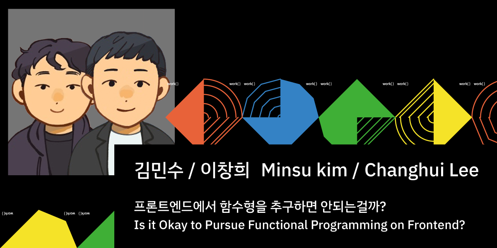

# JSConf Korea 2022 🌈

### "프론트엔드에서 함수형을 추구하면 안되는걸까?" 자료

> 아래 이미지를 클릭하세요.

| 발표 영상 | 발표 자료 |
| :-------: | :-------: |
|   |  |

  
    
      Powered by
      <a href='https://github.com/slidevjs/slidev' target='_blank'>
        slidev
      </a>
      &
      Written by
      <a href="https://github.com/alstn2468">Minsu Kim</a>
      ,
      <a href="https://github.com/blurfx">Changhui Lee</a>
    
  

