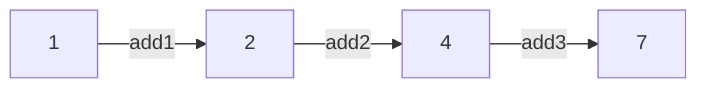

# 프론트엔드에서 함수형을<br/>추구하면 안되는 걸까?

김민수, 이창희

<div class='pt-12'>
  <span @click='$slidev.nav.next' class='px-2 py-1 rounded cursor-pointer' hover='bg-white bg-opacity-10'>
    다음 페이지로 <carbon:arrow-right class='mt-8 inline-block'/>
  </span>
</div>

<div class='abs-br m-6 flex gap-2'>
  <a
    href='https://github.com/alstn2468/2022-jsconf-presentation'
    target='_blank'
    alt='GitHub'
    class='text-xl icon-btn text-dark-900 !border-none'
  >
    <carbon-logo-github />
  </a>
</div>

<!--
"프론트엔드에서 함수형을 추구하면 안되는 걸까?"라는 주제 발표 시작하겠습니다.
-->

---

# 자기소개

<div class='flex mt-8'>
  

  <div class='flex flex-col justify-between'>
    <div>
      <p class='text-3xl font-bold my-0 mb-4'>김민수</p>
      <p class='text-2xl my-0 mb-2'>
        데브시스터즈<br/>
        Software Engineer <span class='text-sm text-light-100'>(Frontend Engineer)</span>
      </p>
      <p class='text-base font-light my-0 mb-2 text-gray-400'>
        JavaScript, TypeScript, ReactJS, GatsbyJS,<br/>
        GraphQL, Functional Programming, …
      </p>
    </div>
    <ul>
      <li class='my-0 mb-0.5 text-sm'>
        <carbon-logo-github />
        <span class='ml-2'>alstn2468</span>
      </li>
      <li class='my-0 mb-0.5 text-sm'>
        <carbon-logo-instagram />
        <span class='ml-2'>minsu._.0102</span>
      </li>
      <li class='my-0 mb-0.5 text-sm'>
        <carbon-logo-linkedin />
        <span class='ml-2'>minsu-kim-developer</span>
      </li>
      <li class='my-0 mb-0.5 text-sm'>
        <carbon-rss />
        <span class='ml-2'>https://alstn2468.github.io</span>
      </li>
    </ul>
  </div>
</div>

<!--
안녕하세요.<br/>

저는 데브시스터즈에서 웹 프론트엔드 개발자로 근무하고 있는 김민수라고 합니다.<br/>

웹 프론트엔드에 사용되는 전반적인 기술에 관심이 많으며, 최근에는 함수형 프로그래밍에 관심이 많습니다.
-->

---

# 자기소개

<div class='flex mt-8'>
  

  <div class='flex flex-col justify-between'>
    <div>
      <p class='text-3xl font-bold my-0 mb-4'>이창희</p>
      <p class='text-2xl my-0 mb-2'>
        前 데브시스터즈<br/>
        Software Engineer <span class='text-sm text-light-100'>(Frontend/Backend Engineer)</span>
      </p>
      <p class='text-base font-light my-0 mb-2 text-gray-400'>
        JavaScript, TypeScript, Golang, Python, …
      </p>
    </div>
    <ul>
      <li class='my-0 mb-0.5 text-sm'>
        <carbon-logo-github />
        <span class='ml-2'>blurfx</span>
      </li>
      <li class='my-0 mb-0.5 text-sm'>
        <carbon-logo-instagram />
        <span class='ml-2'>blureffect</span>
      </li>
      <li class='my-0 mb-0.5 text-sm'>
        <carbon-logo-linkedin />
        <span class='ml-2'>blurfx</span>
      </li>
      <li class='my-0 mb-0.5 text-sm'>
        <carbon-rss />
        <span class='ml-2'>https://xo.dev</span>
      </li>
    </ul>
  </div>
</div>

<!--
창희님 소개
-->

---

# 함수형 프로그래밍이란?

<div class='relative mt-8'>
  
  <mdi-close v-click class='slidev-vclick-target h-100 w-100 absolute top-1/2 left-1/2 transform -translate-x-1/2 -translate-y-1/2 text-red-700' />
</div>

<!--
여러분들은 함수형 프로그래밍하면 무엇이 먼저 떠오르시나요?<br/>

아마 사진처럼 모나드, 범주론과 같이 복잡하고 어려운 것들이 먼저 떠오르실 것 입니다.<br/>

===========================<br/>

이번 발표에서는 이론적인 내용들은 조금만 설명하고 실제 적용 사례에 대해서 소개해보겠습니다.
-->

---

# 함수형 프로그래밍이란?

<p class='text-xl my-8'>
  데이터를 수학적 <strong>계산 함수(순수 함수)</strong>로 처리하고<br/>
  <strong>사이드 이펙트를 멀리</strong>하는 프로그래밍 패러다임
</p>

<p class='text-xl mb-8 slidev-vclick-target' v-click='1'>
  프론트엔드 개발을 하면서 <strong>사이드 이펙트</strong>를 멀리할 수 있나요?<br/>
  <span class='text-orange-400'>DOM 조작, 데이터 패칭 모두 사이드 이펙트를 발생</span>시킬 것 같은데요?
</p>

<p class='text-xl slidev-vclick-target' v-click='2'>
  여러 방법을 통해 <strong>불순 함수</strong>와 <strong>순수 함수</strong>를 <strong>함께 관리</strong>하고<br/>
  이러한 <strong>함수들을 조합</strong>해 프로그램을 만드는 패러다임
</p>

<!--
함수형 프로그래밍은 데이터를 순수 함수로 처리하고 사이드 이펙트를 멀리하는 프로그래밍 패러다임이라는 것 까지는 알고 계실 것 입니다.

===========================<br/>

여러분들은 프론트엔드에서 사용되는 DOM 조작, 비동기 데이터 패칭 동작들 모두 사이드 이펙트를 발생시키지 않나요? 하는 의문을 품으실 수 있으실 겁니다.

============================<br/>

여러분들이 생각하시는 부분이 맞습니다.<br/>

하지만 함수형 프로그래밍은 사이드 이펙트를 사용하지 않는 것이 아닌 순수 함수와 함께 관리하고 여기에서 생겨난 함수들을 조합해 프로그램을 만드는 패러다임 입니다.
-->

---

# 팀에 함수형 프로그래밍 도입하기

<div class='flex items-center mt-8'>
  
  <div class='slidev-vclick-target flex items-center' v-click>
    <mdi-arrow-right-bold class='h-30 w-30 text-red-700' />
    <div class='text-center'>
      
      <p>팀 내부에서 함수형 프로그래밍에 대한 관심이 존재</p>
    </div>
  </div>
</div>

<!--
그렇다면 팀에 함수형 프로그래밍은 어떻게 도입하게 되었을까요?<br/>

우선 제가 개인적으로 스터디를 진행하며 관련 이론들을 공부하고 있었습니다.

===========================<br/>

그러던 중 실제 프로젝트에 간단한 함수형 방법론들을 적용하게 되었고 팀원들이 관심을 갖게되어 같이 스터디를 진행하게 되었었습니다.<br/>
-->

---

# 팀에 함수형 프로그래밍 도입하기

<div class='flex mt-8'>
  <div class='text-center flex flex-col'>
    
    <p>진행하던 프로젝트에 <strong>복잡한 상태를 관리</strong>해야 하는 폼이 존재</p>
  </div>

  <div class='slidev-vclick-target flex items-center ml-8' v-click>
    <mdi-arrow-right-bold class='h-20 w-20 text-red-700' />
    <div class='flex flex-col justify-center ml-8'>
      <p class='m-0 mb-2'>하나의 폼에 <strong>8개의 입력</strong>이 존재</p>
      <p class='m-0 mb-2'>각각 <strong>다른 검증 로직</strong>이 존재</p>
      <p class='m-0 mb-2'><strong>공통으로 사용</strong>할 수 있는 검증 과정 존재</p>
    </div>
  </div>
</div>

<!--
팀 내부에서 스터디를 진행하던 중 프로젝트에서 사진과 같이 복잡한 상태를 관리해야하는 경우가 생겼었습니다.<br/>

===========================<br/>

하나의 폼에 8개의 입력이 존재했고, 각각 다른 유효성 검증 과정이 존재했습니다.<br/>

또한 검증 과정 중에는 공통으로 사용할 수 있는 것 또한 있었습니다.<br/>

이런 문제를 어떻게 잘 해결할 수 있을까 고민하다 저희는 fp-ts를 이용한 함수형 프로그래밍을 도입하는 것으로 결정하게 되었습니다.<br/>

이 부분은 뒤쪽에서 사례와 적용 방법을 더 자세히 설명드리겠습니다.<br/>
-->

---

# 팀에 함수형 프로그래밍 도입하기

<div class='relative h-100'>
<div class='flex items-center mt-8'>
  <div class='text-center flex flex-col'>
    
    <p>fp-ts</p>
  </div>

  <ol class='ml-8 h-80 flex flex-col justify-center'>
    <li class='m-0 mb-2'>
      1. Haskell, PureScript, Scala 기반의 인기있는 <strong>타입 추상화</strong>를 제공
    </li>
    <li class='m-0 mb-2'>
      2. 구현된 타입 클래스는 <strong>안전하게 조합</strong>될 수 있도록 <strong>추상 대수학과 범주론에 기반</strong>
    </li>
    <li class='m-0 mb-2'>
      3. Typescript에서 지원하지 않는 <strong>HKT</strong>(Higher Kinded Types) 구현
    </li>
    <li class='m-0 mb-2'>
      4. io-ts 같이 사용할 수 있는 많음 라이브러리 또한 존재 (fp-ts/ecosystem)
    </li>
  </ol>
</div>

<div class='flex flex-col absolute bottom-6 right-10 text-xs'>
  <a class='text-gray-600 underline mb-1' href='https://github.com/gcanti/fp-ts' target='_blank'>
    https://github.com/gcanti/fp-ts
  </a>
  <a class='text-gray-600 underline mb-1' href='https://github.com/gcanti/io-ts' target='_blank'>
    https://github.com/gcanti/io-ts
  </a>
  <a class='text-gray-600 underline mb-1' href='https://github.com/gcanti/monocle-ts' target='_blank'>
    https://github.com/gcanti/monocle-ts
  </a>
  <a class='text-gray-600 underline mb-1' href='https://gcanti.github.io/fp-ts/ecosystem/' target='_blank'>
    https://gcanti.github.io/fp-ts/ecosystem/
  </a>
  <a class='text-gray-600 underline mb-1' href='https://www.cl.cam.ac.uk/~jdy22/papers/lightweight-higher-kinded-polymorphism.pdf' target='_blank'>
    Lightweight higher-kinded polymorphism
  </a>
</div>
</div>

<!--
많은 함수형 프로그래밍 라이브러리 중에서 fp-ts를 선택한 이유는 무엇일까요?<br/>

fp-ts는 많은 함수형 프로그래밍 언어에서 지원하는 타입 추상화를 제공합니다.<br/>

이 추상화들은 함수형 프로그래밍의 기반 이론을 따르고 있습니다.<br/>

또한 라이브러리와 같이 사용할 수 있는 다양한 라이브러리 생태계가 존재했습니다.<br/>

이제 실제 사례를 살펴보기 전에 필요한 몇가지 타입 추상화와 유틸 함수들을 소개해보겠습니다.
-->

---

# fp-ts의 타입 추상화

<h2 class='mb-2 mt-8 inline-block font-mono'>
  <span class='bg-light-600'>Option&lt;A></span>
</h2>

```ts
type None = { _tag: 'None' };
type Some<A> = { _tag: 'Some', value: A };
type Option<A> = None | Some<A>;
```

<div>
  <p class='mt-2 mb-2 text-normal'>
    <span class='bg-light-600 font-mono font-bold'>Option&ltA></span>는 선택적인 값 <span class='bg-light-600 font-mono font-bold'>A</span>를 위한 컨테이너 입니다.
  </p>
  <p class='mt-0 mb-2 text-normal'>
    <span class='bg-light-600 font-mono font-bold'>A</span> 타입의 값이 존재한다면 <span class='bg-light-600 font-mono font-bold'>Option&ltA></span>는 <span class='bg-light-600 font-mono font-bold'>Some&ltA></span> 인스턴스입니다.<br/>
  </p>
  <p class='mt-0 mb-2 text-normal'>
    값이 존재하지 않는다면 <span class='bg-light-600 font-mono font-bold'>Option&ltA></span>는 <span class='bg-light-600 font-mono font-bold'>None</span> 인스턴스입니다.
  </p>

  <p class='mt-8 text-xl'>
    <span class='bg-light-600 font-mono font-bold'>Option&ltA></span>는 <strong>실패할 수 있는 계산</strong>의 효과를 나타냅니다.
  </p>
</div>

<!--
Option 타입 추상화는 None 타입과 Some 타입으로 구성된 합타입 입니다.<br/>

Option 타입은 선택적인 A 타입 값을 갖는 컨테이너 입니다.<br/>

A 타입 값이 존재한다면 Option 타입은 Some 인스턴스 입니다.<br/>

값이 존재하지 않는다면 Option 타입은 None 인스턴스 입니다.<br/>

Option 타입은 일반적으로 실패할 수 있는 계산의 효과를 나타냅니다.

이제 Option 타입을 사용하는 몇가지 예시들을 살펴보겠습니다.
-->

---

# fp-ts의 타입 추상화

<h2 class='mb-2 mt-8 inline-block font-mono'>
  <span class='bg-light-600'>Option&lt;A></span>
</h2>

```ts
type None = { _tag: 'None' };
type Some<A> = { _tag: 'Some', value: A };
type Option<A> = None | Some<A>;
```

```ts {1|3-9|11-13}
import { Option, some, none } from 'fp-ts/lib/Option';

function findIndex<A>(
  as: Array<A>,
  predicate: (a: A) => boolean
): Option<number> {
  const index = as.findIndex(predicate);
  return index === -1 ? none : some(index);
}

const arr = [1, 2, 3];
findIndex(arr, (n) => n === 1); // { _tag: 'Some', value: 0 }
findIndex(arr, (n) => n === 4); // { _tag: 'None' }
```

<!--
Option 타입은 첫번째 라인과 같이 가져올 수 있습니다.<br/>

some과 none을 이용해 각각의 타입 인스턴스들을 생성할 수 있습니다.<br/>

===========================<br/>

배열에서 특정 값이 있는 인덱스를 찾는 finIndex 함수는 값이 존재하지 않는다면 -1을 반환합니다.<br/>

배열에서 값을 찾는데 성공한다면 인덱스 값을 갖는 Some 인스턴스를 반환합니다.<br/>

배열에서 값을 찾는데 실패한다면 None 인스턴스를 반환합니다.<br/>

===========================<br/>

실제로는 이렇게 사용할 수 있습니다.<br/>

배열 내부에 1이라는 값이 있을 때에는 Some 태그와 value를 갖는 객체가 반환됩니다.<br/>

배열 내부에 4라는 값이 없을 경우에는 None 태그를 갖는 객체가 반환됩니다.
-->

---

# fp-ts의 타입 추상화

<h2 class='mb-2 mt-8 inline-block font-mono'>
  <span class='bg-light-600'>Option&lt;A></span>
</h2>

```ts
type None = { _tag: 'None' };
type Some<A> = { _tag: 'Some', value: A };
type Option<A> = None | Some<A>;
```

```ts {1|3-5}
import { fromNullable } from 'fp-ts/lib/Option';

fromNullable(undefined); // { _tag: 'None' }
fromNullable(null);      // { _tag: 'None' }
fromNullable(0);         // { _tag: 'Some', value: 0 }
```

<!--
fromNullable 함수를 이용해서 Option 타입을 생성할 수도 있습니다.<br/>

===========================<br/>

fromNullable 함수는 Nullable한 값이 인자로 전달되면 None이 반환됩니다.<br/>

반대의 경우에는 해당 값을 갖는 Some 인스턴스를 반환합니다.<br/>
-->

---

# fp-ts의 타입 추상화

<h2 class='mb-2 mt-8 inline-block font-mono'>
  <span class='bg-light-600'>Option&lt;A></span>
</h2>

```ts
type None = { _tag: 'None' };
type Some<A> = { _tag: 'Some', value: A };
type Option<A> = None | Some<A>;
```

```ts {1|3-4|6-8}
import { fromPredicate } from 'fp-ts/lib/Option';

const isNumber = <T>(a: T) => !isNaN(Number(a));
const getOptionNumber = fromPredicate(isNumber);

getOptionNumber('a')   // { _tag: 'None' }
getOptionNumber('10'); // { _tag: 'Some', value: '10' }
getOptionNumber(1);    // { _tag: 'Some', value: 1 }
```

<!--
또한 fromPredicate 라는 함수를 이용해서도 Option 인스턴스를 생성할 수 있습니다.<br/>

fromPredicate 함수는 boolean을 반환하는 함수를 인자로 전달받습니다.<br/>

===========================<br/>

isNumber 함수를 fromPredicate 함수에 전달해 getOptionNumber 함수를 만들었습니다.<br/>

===========================<br/>

isNumber 함수가 true를 반환하는 경우에는 Some 인스턴스가 반환됩니다.<br/>

isNumber 함수가 false를 반환하는 경우에는 None 인스턴스가 반환됩니다.<br/>
-->

---

# fp-ts의 타입 추상화

<h2 class='mb-2 mt-8 inline-block font-mono'>
  <span class='bg-light-600'>Either&lt;E,A></span>
</h2>

```ts
type Left<E> = { _tag: 'Left', left: E };
type Right<A> = { _tag: 'Right', right: A };
type Either<E, A> = Left<E> | Right<A>;
```

<div>
  <p class='mt-2 mb-2 text-normal'>
    <span class='bg-light-600 font-mono font-bold'>Either&ltE,A></span>는 두 개의 타입 중 하나의 값을 표현합니다.
    <span class='text-xs inline-block relative'>
      (분리 합집합, Disjoint Union)
      
    </span>
  </p>
  <p class='mt-0 mb-2 text-normal'>
    <span class='bg-light-600 font-mono font-bold'>Either</span>의 인스턴스는 <span class='bg-light-600 font-mono font-bold'>Left</span> 또는 <span class='bg-light-600 font-mono font-bold'>Right</span> 인스턴스 입니다.
  </p>
  <p class='mt-0 mb-2 text-normal'>
    <span class='bg-light-600 font-mono font-bold'>Either</span>는 결측값을 처리하기 위해 <span class='bg-light-600 font-mono font-bold'>Option</span> 대신에 사용할 수 있습니다.
  </p>
  <p class='mt-0 mb-2 text-normal'>
    <span class='bg-light-600 font-mono font-bold'>Option</span>의 <span class='bg-light-600 font-mono font-bold'>None</span>은 정보를 포함할 수 있는 <span class='bg-light-600 font-mono font-bold'>Left</span>로 대체 됩니다.
  </p>

  <p class='mt-8 text-xl'>
    일반적으로 <span class='bg-light-600 font-mono font-bold'>Left</span>는 <strong>실패</strong>를 표현하고 <span class='bg-light-600 font-mono font-bold'>Right</span>는 <strong>성공</strong>을 표현합니다.
  </p>
</div>

<!--
Either 타입은 Option 타입과 비슷하게 두 개의 타입 중 하나의 값을 표현합니다.<br/>

Either의 인스턴스는 Left와 Right 인스턴스 입니다.<br/>

Either 타입은 결측값을 처리하기 위해 Option 대신에 사용할 수 있습니다.<br/>

Option의 None은 값을 포함할 수 있는 Left로 대체됩니다.<br/>

일반적으로 Left은 실패를 표현하고 Right는 성공을 표현합니다.<br/>

Either 타입을 사용하는 몇개의 예시들을 살펴보겠습니다.<br/>
-->

---

# fp-ts의 타입 추상화

<h2 class='mb-2 mt-8 inline-block font-mono'>
  <span class='bg-light-600'>Either&lt;E,A></span>
</h2>

```ts
type Left<E> = { _tag: 'Left', left: E };
type Right<A> = { _tag: 'Right', right: A };
type Either<E, A> = Left<E> | Right<A>;
```

```ts {1|3-8|10-14}
import { Either, tryCatch } from 'fp-ts/lib/Either';

function parse(s: string): Either<Error, unknown> {
  return tryCatch(
    () => JSON.parse(s),
    (reason) => new Error(String(reason)),
  );
}

const success = '{"a": 1, "b": 2}';
const fail = '{"a": 1, "b"}';

parse(success); // { _tag: 'Right', right: { a: 1, b: 2 } }
parse(fail);    // { _tag: 'Left', left: 'Error: SyntaxError: Unexpected token...' }
```

<!--
Either는 예외를 발생시키는 경우에 자주 사용됩니다.<br/>

이번 예시에서는 tryCatch 함수를 같이 사용해보겠습니다.<br/>

===========================<br/>

문자열을 JavaScript 객체로 바꾸어주는 parse 함수를 Either를 반환하도록 구현했습니다.<br/>

tryCatch를 이용해 기존의 parse 함수가 예외를 발생시킬 경우 Error를 담는 Left를 반환합니다.<br/>

parse 함수가 정상적으로 실행될 경우 JavaScript 객체를 담은 Right를 반환합니다.<br/>

============================<br/>

예시와 같이 성공적으로 변환되는 객체의 경우에는 Right 태그와 값을 갖는 right 속성을 가진 객체가 반환됩니다.<br/>

예외가 발생하는 경우에는 Left 태그와 left 값을 갖는 객체가 반환됩니다.<br/>
-->

---

# fp-ts의 타입 추상화

<h2 class='mb-2 mt-8 inline-block font-mono'>
  <span class='bg-light-600'>Either&lt;E,A></span>
</h2>

```ts
type Left<E> = { _tag: 'Left', left: E };
type Right<A> = { _tag: 'Right', right: A };
type Either<E, A> = Left<E> | Right<A>;
```

```ts {1|3|5-7}
import { fromNullable } from 'fp-ts/lib/Either';

const getEitherString = fromNullable('defaultValue');

getEitherString(null);      // { _tag: 'Left', left: 'defaultValue' }
getEitherString(undefined); // { _tag: 'Left', left: 'defaultValue' }
getEitherString('value');   // { _tag: 'Right', right: 'value' }
```

<!--
Either 타입에도 Option과 같이 fromNullable과 fromPredicate 함수를 사용할 수 있습니다.<br/>

===========================<br/>

다른 점은 Either 타입은 Left가 반환될 경우 사용될 값을 인자로 전달 받습니다.<br/>

============================<br/>

nullable한 값이 전달되는 경우 위의 함수에서 전달한 값을 갖는 Left 인스턴스가 반환되는 것을 볼 수 있습니다.<br/>

반대의 경우에는 해당 값을 갖는 Right 인스턴스가 반환됩니다.<br/>
-->

---

# fp-ts의 타입 추상화

<h2 class='mb-2 mt-8 inline-block font-mono'>
  <span class='bg-light-600'>Either&lt;E,A></span>
</h2>

```ts
type Left<E> = { _tag: 'Left', left: E };
type Right<A> = { _tag: 'Right', right: A };
type Either<E, A> = Left<E> | Right<A>;
```

```ts {1|3-7|9-10}
import { fromPredicate } from 'fp-ts/lib/Either';

const isEmptyString = (s: string) => s === '';
const getEitherString = fromPredicate(
  (s: string) => !isEmptyString(s),
  () => 'defaultValue',
);

getEitherString('');    // { _tag: 'Left', left: 'defaultValue' }
getEitherString('abc'); // { _tag: 'Right', right: 'abc' }
```

<!--
fromPredicate 함수도 fromNullable 함수와 동일합니다.<br/>

===========================<br/>

Left 인스턴스가 반환될 때 사용될 값을 반환하는 함수를 추가적으로 두번째 인자로 전달 받습니다.<br/>

===========================<br/>

Left 인스턴스가 반환될 경우 fromPredicate 함수에 두번째 인자로 전달된 함수가 실행되어 값이 담겨 반환되는 것을 확인할 수 있습니다.<br/>

첫번째 인자로 전달된 함수가 true를 반환할 경우 해당 값을 담는 Right 인스턴스가 반환됩니다.<br/>
-->

---

# fp-ts의 타입 추상화

<h2 class='mb-2 mt-8 inline-block font-mono'>
  <span class='bg-light-600'>Task&lt;A></span> <span class='bg-light-600'>TaskEither&ltE,A></span>
</h2>

```ts
type Left<E> = { _tag: 'Left', left: E };
type Right<A> = { _tag: 'Right', right: A };
type Either<E, A> = Left<E> | Right<A>;
type Task<A> = { (): Promise<A> };
type TaskEither<E, A> = Task<Either<E, A>>;
```

<div>
  <p class='mt-2 mb-2 text-normal'>
    <span class='bg-light-600 font-mono font-bold'>Task&ltA></span>는 <span class='bg-light-600 font-mono font-bold'>A</span> 타입의 값을 반환하는 비동기 계산을 표현합니다.
  </p>
  <p class='mt-2 mb-2 text-normal'>
    <span class='bg-light-600 font-mono font-bold'>Task&ltA></span>는 <strong>절대 실패하지</strong> 않는 비동기 계산에 사용됩니다.
  </p>
  <p class='mt-2 mb-2 text-normal'>
    실패할 수 있는 비동기 계산은 <span class='bg-light-600 font-mono font-bold'>TaskEither&ltE,A></span>를 사용할 수 있습니다.
  </p>
</div>

<!--
Task 타입은 절대 실패하지 않는 비동기 계산을 표현합니다.<br/>

실패할 수 있는 비동기 계산은 앞에서 설명한 Either를 같이 사용한 TaskEither 타입을 사용할 수 있습니다.<br/>
-->

---

# fp-ts의 타입 추상화

<h2 class='mb-2 mt-8 inline-block font-mono'>
  <span class='bg-light-600'>Task&lt;A></span> <span class='bg-light-600'>TaskEither&ltE,A></span>
</h2>

```ts
type Left<E> = { _tag: 'Left', left: E };
type Right<A> = { _tag: 'Right', right: A };
type Either<E, A> = Left<E> | Right<A>;
type Task<A> = { (): Promise<A> };
type TaskEither<E, A> = Task<Either<E, A>>;
```

<div class='relative'>

```ts {1|3-16|18} {maxHeight: 100}
import { Task } from 'fp-ts/lib/Task';

const read: Task<string> = () => {
  return new Promise<string>((resolve) => {
    const rl = createInterface({
      input: process.input,
      output: process.stdout,
    });

    rl.question('Input: ', (answer) => {
      rl.close();
      console.log(answer);
      resolve(answer);
    });
  });
}

read();
```

  

</div>

<!--
Skip

===========================<br/>

사용자에게 입력을 받는 비동기 작업을 실행하는 read 함수를 작성했습니다.<br/>

read 함수는 프로그램이 동작하는 한 사용자의 입력을 계속 기다리며 실패하지 않습니다.<br/>

===========================<br/>

Skip

===========================<br/>

사진과 같이 read 함수가 잘 실행되는 것을 볼 수 있습니다.
-->

---

# fp-ts의 타입 추상화

<h2 class='mb-2 mt-8 inline-block font-mono'>
  <span class='bg-light-600'>Task&lt;A></span> <span class='bg-light-600'>TaskEither&ltE,A></span>
</h2>

```ts
type Left<E> = { _tag: 'Left', left: E };
type Right<A> = { _tag: 'Right', right: A };
type Either<E, A> = Left<E> | Right<A>;
type Task<A> = { (): Promise<A> };
type TaskEither<E, A> = Task<Either<E, A>>;
```

<div class='relative'>

```ts {1|3-10|12-20}  {maxHeight: 100}
import { TaskEither, tryCatch } from 'fp-ts/lib/TaskEither';

function taskEitherTest(isResolve: boolean): TaskEither<string, string> {
  return tryCatch(
    () => isResolve
      ? Promise.resolve('resolved')
      : Promise.reject('rejected'),
    () => 'fall back string',
  );
}

async function run() {
  const resolve = taskEitherTest(true);
  const reject = taskEitherTest(false);

  console.log(await resolve());
  console.log(await reject());
}

run();
```

  

</div>

<!--
TaskEither 타입도 Either와 동일하게 tryCatch 함수를 사용할 수 있습니다.<br/>

===========================<br/>

Promise가 resolve될 경우 resolve된 값을 갖는 Right 인스턴스를 반환합니다.<br/>

reject될 경우 두번째 인자로 전달된 함수가 실행되어 반환된 값을 갖는 Left 인스턴스가 반환됩니다.<br/>

===========================<br/>

비동기 함수이기 때문에 async-await 키워드를 같이 이용해서 함수를 실행합니다.<br/>

===========================<br/>

앞서 설명한 것과 같이 각각 상황에 맞는 인스턴스들이 잘 반환된 것을 확인할 수 있습니다.<br/>
-->

---

# fp-ts의 유틸 함수

<h2 class='mb-2 mt-8 inline-block font-mono'>
  <span class='bg-light-600'>pipe</span>
</h2>



<div>

  <p class='text-base'>
    <span class='bg-light-600 font-mono font-bold'>pipe</span>를 사용하지 않고 함수를 합성하는 경우
  </p>


```ts {1|3-5|7}
const add = (a: number) => (b: number) => a + b;

const add1 = add(1);
const add2 = add(2);
const add3 = add3(3);

add3(add2(add1(1))); // 7
```

</div>

<!--
이제 fp-ts의 몇가지 유틸함수인 pipe 함수를 소개하겠습니다.<br/>

예시와 같이 두 숫자를 더하는 커링된 add 함수가 있습니다.<br/>

===========================<br/>

add 함수를 이용해 1, 2, 3을 더하는 함수들을 만들었습니다.<br/>

위의 그림처럴 각각의 함수들을 순차적으로 실행시킬 경우에는 어떤식으로 함수를 호출할 수 있을까요?<br/>

===========================<br/>

이렇게 함수 호출 안에서 함수를 호출하는 방식으로 함수들을 조합할 수 있을겁니다.<br/>
-->

---

# fp-ts의 유틸 함수

<h2 class='mb-2 mt-8 inline-block font-mono'>
  <span class='bg-light-600'>pipe</span>
</h2>


<div>

  <p class='text-base'>
    <span class='bg-light-600 font-mono font-bold'>pipe</span>를 사용하지 않았을 때 합성되는 함수의 수가 점점 많아진다면 어떻게 될까요??
  </p>

  <div v-click='1' class='slidev-vclick-target relative'>

```ts {7}
const add = (a: number) => (b: number) => a + b;

const add1 = add(1);
const add2 = add(2);
const add3 = add3(3);

add3(add3(add3(add3(add3(add2(add1(1)))))));
```

  <div v-click='2' class='slidev-vclick-target absolute bottom-4 right-4 text-center'>
    
    <span class='text-base text-light-100'>Callback Hell이 떠오르시지 않나요?</span>
  </div>

  </div>

</div>

<!--
하지만 합성하는 함수의 개수가 점점 많아지게 되면 어떻게 될까요?<br/>

===========================<br/>

코드가 굉장히 복잡해지는 것을 확인할 수 있습니다.<br/>

===========================<br/>

조금 더 편하게 보기 위해서 함수 호출을 할 때마다 개행을 한다면?<br/>

아마 콜백 헬과 같은 상황이 떠오르실 겁니다.<br/>
-->

---

# fp-ts의 유틸 함수

<h2 class='mb-2 mt-8 inline-block font-mono'>
  <span class='bg-light-600'>pipe</span>
</h2>


<div class='relative'>

  <p class='text-base'>
    <span class='bg-light-600 font-mono font-bold'>pipe</span>를 사용해 함수를 합성하는 경우
  </p>


```ts {1,9-10}
import { pipe } from 'fp-ts/lib/function';

const add = (a: number) => (b: number) => a + b;

const add1 = add(1);
const add2 = add(2);
const add3 = add3(3);

pipe(1, add1, add2, add3);
pipe(1, add1, add2, add3, add3, add3, add3, add3, add3);
```

  <div v-click class='slidev-vclick-target absolute bottom-4 right-12 text-center'>
    
    <span class='text-sm block mb-1 text-light-100'>
      JavaScript의 pipe 연산자 |>는 제안 Stage 2단계에 있습니다.
    </span>
    <span class='text-sm block'>
      <a href='https://github.com/tc39/proposal-pipeline-operator' target='_blank' class='text-gray-400 underline'>
        https://github.com/tc39/proposal-pipeline-operator
      </a>
    </span>
  </div>

</div>

<!--
pipe 함수를 사용하면 예시와 같이 함수를 합성할 수 있습니다.<br/>

한눈에 보기에도 함수가 합성되는 흐름을 따라가기에 훨씬 수월합니다.<br/>

그저 pipe 함수에 전달된 인자를 왼쪽에서 오른쪽으로 읽기만 하면 됩니다.<br/>

===========================<br/>

소개시켜드린 유틸 함수인 pipe는 현제 자바스크립트 연산자로 제안되어 있습니다.<br/>
-->

---

# 타입 추상화를 사용하는 법

<h2 class='mb-2 mt-8 inline-block font-mono'>
  <span class='bg-light-600'>map</span>
</h2>

```ts
declare const optionMap: <A, B>(f: (a: A) => B) => (fa: Option<A>) => Option<B>;
declare const taskMap: <A, B>(f: (a: A) => B) => (fa: Task<A>) => Task<B>;
declare const eitherMap: <A, B>(f: (a: A) => B) => <E>(fa: Either<E, A>) => Either<E, B>;
declare const taskEitherMap: <A, B>(f: (a: A) => B) => <E>(fa: TaskEither<E, A>) => TaskEither<E, B>;
```

<div>
  <p class='mt-2 mb-2 text-normal'>
    <span class='bg-light-600 font-mono font-bold'>map</span>함수는 사상 함수라고 하며 <span class='bg-light-600 font-mono font-bold'>A</span> 타입의 값을 <span class='bg-light-600 font-mono font-bold'>B</span> 타입의 값으로 바꿀 때 사용할 수 있습니다.
  </p>
  <p class='mt-2 mb-2 text-normal'>
    <span class='bg-light-600 font-mono font-bold'>map</span>함수는 공통적으로 <span class='bg-light-600 font-mono font-bold'>(f: (a: A) => B)</span> 시그니처를 갖는 함수를 전달받습니다.
  </p>
</div>

<div class='relative'>

```ts
import { fromNullable, map } from 'fp-ts/lib/Option';

pipe(
  'something value',                // string
  fromNullable,                     // Option<string>
  map((value) => value.length),     // Option<number>
  map((value) => value + 1),        // Option<number>
  map((value) => value.toString()), // Option<string>
);
```

  <div v-click class='slidev-vclick-target absolute bottom-4 right-8 text-center'>
    
    <span class='text-sm block text-light-100'>
      <span class='bg-light-600 text-dark-400 font-mono font-bold'>Some</span> 타입일 경우 <span class='bg-light-600 text-dark-400 font-mono font-bold'>map</span> 함수에 전달된 함수가 실행됩니다.
    </span>
  </div>

</div>

<!--
앞에서 설명해드린 타입 추상화들을 어떻게 사용할 수 있을까요?<br/>

타입 추상화를 사용하기 위해서는 몇가지 함수들을 알아야 합니다.<br/>

첫번째로는 map 함수입니다.<br/>

JavaScript의 배열에 있는 map 함수와 동일한 기능을 하며 사상 함수라고도 합니다.<br/>

타입 추상화들의 map 함수는 공통적으로 A 타입의 값을 B 타입으로 바꾸는 함수를 전달받습니다.<br/>

===========================<br/>

자료의 코드처럼 Some 타입의 경우에는 map 함수에 전달된 함수가 실행됩니다.<br/>

pipe를 따라가보면 string 타입이 fromNullable 함수를 만나 Option<string>이 되었고<br/>

map 함수에 전달된 함수의 시그니처에 따라 타입이 변하는 것을 확인할 수 있습니다.<br/>
-->

---

# 타입 추상화를 사용하는 법

<h2 class='mb-2 mt-8 inline-block font-mono'>
  <span class='bg-light-600'>map</span>
</h2>

```ts
declare const optionMap: <A, B>(f: (a: A) => B) => (fa: Option<A>) => Option<B>;
declare const taskMap: <A, B>(f: (a: A) => B) => (fa: Task<A>) => Task<B>;
declare const eitherMap: <A, B>(f: (a: A) => B) => <E>(fa: Either<E, A>) => Either<E, B>;
declare const taskEitherMap: <A, B>(f: (a: A) => B) => <E>(fa: TaskEither<E, A>) => TaskEither<E, B>;
```

<div>
  <p class='mt-2 mb-2 text-normal'>
    <span class='bg-light-600 font-mono font-bold'>map</span>함수는 사상 함수라고 하며 <span class='bg-light-600 font-mono font-bold'>A</span> 타입의 값을 <span class='bg-light-600 font-mono font-bold'>B</span> 타입의 값으로 바꿀 때 사용할 수 있습니다.
  </p>
  <p class='mt-2 mb-2 text-normal'>
    <span class='bg-light-600 font-mono font-bold'>map</span>함수는 공통적으로 <span class='bg-light-600 font-mono font-bold'>(f: (a: A) => B)</span> 시그니처를 갖는 함수를 전달받습니다.
  </p>
</div>

<div class='relative'>

```ts
import { fromPredicate, map } from 'fp-ts/lib/Option';

pipe(
  1,                                   // number
  fromPredicate((value) => value < 0), // Option<number>
  map((value) => value * value),       // Option<number>
  map((value) => [value]),             // Option<Array<number>>
);
```

  <div v-click class='slidev-vclick-target absolute bottom-4 right-8 text-center'>
    
    <span class='text-sm block text-light-100'>
      <span class='bg-light-600 text-dark-400 font-mono font-bold'>None</span> 타입일 경우 <span class='bg-light-600 text-dark-400 font-mono font-bold'>map</span> 함수에 전달된 함수가 실행되지 않습니다.
    </span>
  </div>

</div>

<!--
반대로 None 인스턴스가 전달된다면 map 함수에 전달된 함수는 실행되지 않습니다.<br/>

===========================<br/>

fromPredicate에 전달된 함수가 false를 반환했기 때문에 None 인스턴스가 전달됩니다.<br/>

따라서 해당 코드의 결과는 None 인스턴스가 되었습니다.
-->

---

# 타입 추상화를 사용하는 법

<h2 class='mb-2 mt-8 inline-block font-mono'>
  <span class='bg-light-600'>chain</span>
</h2>

```ts
const eiterhChain = <E, A, B>(f: (a: A) => Either<E, B>) => (
  ma: Either<E, A>,
): Either<E, B> => (isLeft(ma) ? ma : f(ma.right));
```

<div>
  <p class='mt-2 mb-2 text-normal'>
    <span class='bg-light-600 font-mono font-bold'>chain</span>함수는 다음 계산을 할지말지 결정하기 위해 사용되며
  </p>
  <p class='mt-2 mb-2 text-normal'>
    앞 계산의 반환 값을 이용해 순서대로 계산을 진행합니다.
  </p>
</div>

<div class='relative'>

```ts {0|1-6|8-14} {maxHeight: 100}
import { Either, chain, left, right } from 'fp-ts/lib/Either';
import { pipe } from 'fp-ts/lib/function';

const multiplyByTen = <T>(value: T): Either<string, number> =>
  typeof value === 'number' ? right(value * 10) : left('Not a number');
const increment = (value: number): Either<string, number> => right(value + 1);

const func = <T>(value: T) => pipe(
  value,
  multiplyByTen,
  chain(increment),
);

func('Hello World!');
```

  <div v-click class='slidev-vclick-target absolute bottom-4 right-12 text-center'>
    
    <span class='text-sm block text-light-100'>
      <span class='bg-light-600 text-dark-400 font-mono font-bold'>Left</span> 타입일 경우 <span class='bg-light-600 text-dark-400 font-mono font-bold'>chain</span> 함수에 전달된 함수가 실행되지 않습니다.
    </span>
  </div>

</div>

<!--
chain 함수는 다음 계산을 이어할지 말지 결정하기 위해 사용됩니다.<br/>

앞에 실행된 계산의 결과를 이용해 이후 계산을 순서대로 진행합니다.<br/>

Either 타입의 chain을 예시로 설명해드리겠습니다.<br/>

===========================<br/>

multiplyByTen 함수는 입력값이 숫자이면 10을 곱하고 Right 인스턴스를 반환합니다.<br/>

입력값이 숫자가 아니라면 문자열을 담은 Left 인스턴스를 반환합니다.<br/>

increment는 숫자를 받아 1을 더한 값을 담은 Right 인스턴스를 반환하는 함수입니다.<br/>

===========================<br/>

이 함수들을 합성해 새로운 함수인 func 함수를 만들었습니다.<br/>

func 함수를 호출할 때 전달된 값이 문자열이기 때문에 multiplyByTen 함수는 Left 인스턴스를 반환합니다.<br/>

따라서 chain에 전달된 increment 함수는 실행되지 않고 Left 인스턴스가 최종적으로 반환됩니다.<br/>
-->

---

# 타입 추상화를 사용하는 법

<h2 class='mb-2 mt-8 inline-block font-mono'>
  <span class='bg-light-600'>chain</span>
</h2>

```ts
const eiterhChain = <E, A, B>(f: (a: A) => Either<E, B>) => (
  ma: Either<E, A>,
): Either<E, B> => (isLeft(ma) ? ma : f(ma.right));
```

<div>
  <p class='mt-2 mb-2 text-normal'>
    <span class='bg-light-600 font-mono font-bold'>chain</span>함수는 다음 계산을 할지말지 결정하기 위해 사용되며
  </p>
  <p class='mt-2 mb-2 text-normal'>
    앞 계산의 반환 값을 이용해 순서대로 계산을 진행합니다.
  </p>
</div>

<div class='relative'>

```ts {14} {maxHeight: 100}
import { Either, chain, left, right } from 'fp-ts/lib/Either';
import { pipe } from 'fp-ts/lib/function';

const multiplyByTen = <T>(value: T): Either<string, number> =>
  typeof value === 'number' ? right(value * 10) : left('Not a number');
const increment = (value: number): Either<string, number> => right(value + 1);

const func = <T>(value: T) => pipe(
  value,
  multiplyByTen,
  chain(increment),
);

func(10);
```

  <div v-click class='slidev-vclick-target absolute bottom-4 right-12 text-center'>
    
    <span class='text-sm block text-light-100'>
      <span class='bg-light-600 text-dark-400 font-mono font-bold'>Right</span> 타입일 경우 <span class='bg-light-600 text-dark-400 font-mono font-bold'>chain</span> 함수에 전달된 함수가 실행 됩니다.
    </span>
  </div>

</div>

<!--
반대로 전달된 값이 숫자인 10일 경우 multiplyByTen 함수는 숫자 100을 담은 Right 인스턴스가 반환될 것입니다.<br/>

Right 인스턴스가 chain 함수로 전달되어 chain에 전달되었던 increment 함수가
호출되어 1이 더해진 Right 인스턴스가 반환되는 것을 확인할 수 있습니다.<br/>
-->

---

# 타입 추상화를 사용하는 법

<h2 class='mb-2 mt-8 inline-block font-mono'>
  <span class='bg-light-600'>match</span> <span class='bg-light-600'>fold</span>
</h2>

```ts
declare const optionMatch: <A, B>(onNone: () => B, onSome: (a: A) => B) =>
  (ma: Option<A>) => B;
declare const eitherMatch: <E, A, B>(onNone: (e: E) => B, onSome: (a: A) => B) =>
  (ma: Either<E, A>) => B;
```

<div>
  <p class='mt-2 mb-2 text-normal'>
    <span class='bg-light-600 font-mono font-bold'>match</span>와 <span class='bg-light-600 font-mono font-bold'>fold</span> 함수는 동일한 기능을 수행하며 가능한 케이스에 따라 실행할 함수를 받아 실행합니다.
  </p>
</div>

<div class='relative'>

```ts {0|1-8} {maxHeight: 100}
import { fromPredicate, match } from 'fp-ts/lib/Option';
import { pipe } from 'fp-ts/lib/function';

pipe(
  2,
  fromPredicate((value) => value !== 0),
  match(() => 0, (value) => 10 / value),
);
```

  <div v-click class='slidev-vclick-target absolute bottom-4 right-12 text-center'>
    
    <span class='text-sm block text-light-100'>
      <span class='bg-light-600 text-dark-400 font-mono font-bold'>Option</span> 의 <span class='bg-light-600 text-dark-400 font-mono font-bold'>Some</span> 타입일 경우 두 번째 인자로 전달된 함수가 실행됩니다.
    </span>
  </div>

</div>

<!--
마지막으로 match와 fold 함수에 대해서 설명해 드리겠습니다.<br/>

match와 fold 함수는 동일한 기능을 하면 Option 타입일 경우 Some과 None,
Either 타입의 경우 Left와 Right의 각각 경우에 따라 실행할 함수를 전달받아 실행합니다.<br/>

===========================<br/>

pipe의 첫번째로 전달된 값이 0이 아닐 경우에 fromPredicate 함수는 Some 인스턴스를 반환합니다.<br/>

Some 인스턴스가 match 함수에 전달될 경우 두번째 인자로 전달된 함수가 실행됩니다.
-->

---

# 타입 추상화를 사용하는 법

<h2 class='mb-2 mt-8 inline-block font-mono'>
  <span class='bg-light-600'>match</span> <span class='bg-light-600'>fold</span>
</h2>

```ts
declare const optionMatch: <A, B>(onNone: () => B, onSome: (a: A) => B) =>
  (ma: Option<A>) => B;
declare const eitherMatch: <E, A, B>(onNone: (e: E) => B, onSome: (a: A) => B) =>
  (ma: Either<E, A>) => B;
```

<div>
  <p class='mt-2 mb-2 text-normal'>
    <span class='bg-light-600 font-mono font-bold'>match</span>와 <span class='bg-light-600 font-mono font-bold'>fold</span> 함수는 동일한 기능을 수행하며 가능한 케이스에 따라 실행할 함수를 받아 실행합니다.
  </p>
</div>

<div class='relative'>

```ts {4-8} {maxHeight: 100}
import { fromPredicate, match } from 'fp-ts/lib/Option';
import { pipe } from 'fp-ts/lib/function';

pipe(
  0,
  fromPredicate((value) => value !== 0),
  match(() => 0, (value) => 10 / value),
);
```

  <div v-click class='slidev-vclick-target absolute bottom-4 right-12 text-center'>
    
    <span class='text-sm block text-light-100'>
      <span class='bg-light-600 text-dark-400 font-mono font-bold'>Option</span> 의 <span class='bg-light-600 text-dark-400 font-mono font-bold'>None</span> 타입일 경우 첫 번째 인자로 전달된 함수가 실행됩니다.
    </span>
  </div>

</div>

<!--
pipe의 첫번째로 전달된 값이 0일 경우에 fromPredicate 함수는 None 인스턴스를 반환합니다.<br/>

None 인스턴스가 match 함수에 전달될 경우 첫번째 인자로 전달된 함수가 실행됩니다.<br/>

지금까지 몇개의 타입 추상화와 함수, pipe 함수들을 살펴보았습니다.<br/>

이제 이 이론들을 사용해 현실의 문제를 해결한 사례를 소개해드리겠습니다.<br/>
-->

---

# 현실의 문제 해결 하기

폼에 8개의 입력이 존재하는데, 이것을 어떻게 우아하게 처리할 수 있을까요?


<!--
이제 앞에서 민수님이 소개해주신 개념으로 저희가 현실의 문제를 어떻게 해결했는지 알아보겠습니다. <다음>
-->

---

# 우리가 폼에서 해야하는 일

<ol class="list-decimal ml-6 text-2xl">
  <li>사용자에게 값 입력받기</li>
  <li>입력된 값 검증하기</li>
  <li>검증에 실패했다면 오류 메시지 보여주기</li>
</ol>


<!--
저희는 회사의 채용 사이트를 개발하면서 사용자의 여러 정보를 입력받고 검증해야 하는 문제가 있었습니다. 하지만 관리해야 하는 값이 너무 많았습니다.<다음>
-->

---

```ts {all|1-2|4-21|23-28|31-37|39-44} {maxHeight: '450px'}
const [mobileNumber, setMobileNumber] = React.useState<string>('');
const [mobileNumberError, setMobileNumberError] = React.useState<string>('');

// 올바른 형식의 휴대폰 번호인지 검증하는 함수
const validateMobileNumber = (value: string): boolean => {
  if (value == '') {
    setMobileNumberError('휴대폰 번호를 입력해주세요.');
    return false;
  }

  if (!mobileNumberRegex.test(value)
      || !value.startswith('01')
      || value.length < 10
      || value.length > 11
  ) {
    setMobileNumberError('휴대폰 번호가 올바르지 않습니다.');
    return false;
  }

  return true;
}

// 휴대폰 번호 input의 onChange 이벤트 핸들러
const handleMobileNumberChange = (e) => {
  const { value } = e.target;
  validateMobileNumber(value);
  setMobileNumber(value);
}

// form onsubmit 이벤트 핸들러
const onSubmit = () => {
  const validations = [validateMobileNumber(mobileNumber), ...];
  if (validations.some((valid) => !valid)) {
    return;
  }
  // Submit Form ...
}

return (
  ...
  <input onChange={handleMobileNumberChange} value={mobileNumber} />
  <span className="error">{mobileNumberError}</span>
  ...
)

```

<!--
먼저 휴대폰 번호를 입력받는 필드만 있다고 가정하고 코드를 보겠습니다.<다음>

휴대폰 번호 입력을 관리하기 위한 상태와 번호 입력에 관한 오류 메시지를 관리하는 상태 두 개가 있고, <다음>

입력된 번호가 입력은 되어 있는지 그리고 올바른지 검사를 하는 검증 함수 하나와 <다음>

입력에 onChange 이벤트가 생길때마다 두 상태를 갱신 하는 이벤트 핸들러 하나가 있고요<다음>

그리고 form onSubmit 이벤트 핸들러와<다음>

렌더링은 이렇게 입력과 오류 메시지를 보여주는 span 엘리먼트가 있습니다.
-->

---

# 현재 상태

### 검증 가능한 입력 필드 하나를 구현하기 위해 우리는 아래의 것들이 필요합니다.

<ul class="list-disc ml-6 text-xl">
  <li>2개의 React.useState (입력 값, 오류 메시지)</li>
  <li>1개의 필드 검증 함수</li>
  <li>검증 함수를 호출하고 입력 값 상태를 관리하는 1개의 이벤트 핸들러 콜백 함수</li>
</ul>

<div v-click class="text-xl mt-8 font-bold">
  <carbon:arrow-right class='mt-8 inline-block'/> 8개의 필드가 있다면, 16개의 상태와 8개의 이벤트 핸들러가 필요합니다.
</div>

<!--
앞의 코드를 다시 정리해보면 저희는 하나의 필드를 검증하고 관리하기 위해

useState를 사용한 2개의 상태와, 1개의 필드 검증 함수 그리고 검증 함수를 호출하고 입력 값 상태를 관리하는 1개의 이벤트 핸들러 콜백 함수가 필요합니다. <다음>

실제로 해당 페이지에는 8개의 필드가 있으니 이를 모두 앞선 방식으로 구현한다면 16개의 상태와 8개의 이벤트 핸들러에 관한 코드를 작성해야합니다.
-->

---
layout: center
---

```ts {maxHeight: '450px'}
const [mobileNumber, setMobileNumber] = React.useState<string>('');
const [mobileNumberError, setMobileNumberError] = React.useState<string>('');
const [name, setName] = React.useState<string>('');
const [nameError, setNameError] = React.useState<string>('');
const [email, setEmail] = React.useState<string>('');
const [emailError, setEmailError] = React.useState<string>('');

const validateMobileNumber = (value: string): boolean => {
  /* ... */
};
const validateName = (value: string): boolean => {
  /* ... */
};
const validateEmail = (value: string): boolean => {
  /* ... */
};

const handleMobileNumberChange = (e) => {
  /* ... */
};
const handleNameChange = (e) => {
  /* ... */
};
const handleEmailChange = (e) => {
  /* ... */
};
```

<!--
코드로 본다면 이런 모습이 되겠죠.
-->

---
layout: center
---

<span class="text-8xl">🤔</span>

<!--
이제 이 문제를 어떻게 해결할까 고민에 빠집니다. 여러분이라면 어떻게 문제를 해결하셨을 것 같으신가요?
-->

---

# 솔루션?

## 1. React-Hook-Form

## 2. Formik

<h2 v-click>3. fp-ts</h2>

<!--
사실 이미 React-Hook-Form이나 Formik같은 좋은 폼 관리 라이브러리가 나와있습니다.<다음>

하지만 저희는 함수형 프로그래밍을 프로젝트에 본격적으로 적용해보고 싶었고 fp-ts를 사용하여 문제를 해결하는 방법을 선택했습니다.
-->

---

# 공통 부분 문제 찾기

<ol class="list-decimal ml-6 text-2xl">
  <li>입력 값과 오류 메시지를 관리하는 두 개의 상태가 있습니다.</li>
  <li>사용자가 값을 입력하면 상태를 갱신합니다.</li>
  <li>검증 함수를 통해 사용자가 입력한 값이 올바른지 검증합니다.</li>
  <li>검증에 오류가 있다면 오류 메시지 상태를 갱신합니다.</li>
</ol>

<!--
일단 이 문제를 어떻게 해결해보기전에, 먼저 문제를 분석해보았습니다.

먼저, 입력 값과 오류 메시지를 관리하는 두개의 상태가 있고, 사용자가 값을 입력하면 상태를 갱신하고

검증 함수를 통해 값이 올바른지 확인 한 다음, 만약 값이 올바르지 않다면 오류 메시지 상태를 갱신해서 사용자에게 무엇이 문제인지 알려줍니다.
-->

---

# 공통 부분 문제 찾기

<ol class="list-decimal ml-6 text-2xl">
  <li><span class="text-orange-500/90 font-bold">입력 값</span>과 <span class="text-orange-500/90 font-bold">오류 메시지</span>를 관리하는 두 개의 상태가 있습니다.</li>
  <li>사용자가 값을 입력하면 상태를 갱신합니다.</li>
  <li><span class="text-orange-500/90 font-bold">검증 함수</span>를 통해 사용자가 입력한 값이 올바른지 검증합니다.</li>
  <li>검증에 오류가 있다면 오류 메시지 상태를 갱신합니다.</li>
</ol>

<!--
여기서 외부에서 들어오는, 즉 입력 필드마다 달라지는 부분은 입력 값,메시지, 검증 함수가 있습니다.

그렇다면 세가지 값들을 외부에서 주입시키는 형태로 만들어 나머지 부분들을 모두 공통 함수로 만들어 버리면 되지 않을까요?
-->

---

# 문제 해결 하기

<ol class="list-decimal ml-6 text-2xl">
  <li>공통적으로 사용할 수 있는 검증 함수 만들기</li>
  <li>검증 규칙 정의하기</li>
  <li>입력 필드 검증기 만들기</li>
  <li>커스텀 훅 만들기</li>
</ol>

<!--
그래서 저희는 이렇게 네 가지의 단계를 거쳐 공통적인 부분을 처리하도록 했습니다. 이제 본격적으로 코드를 보면서 이 문제를 어떻게 해결했는지, 휴대폰 번호 입력 필드를 예를 들어 알아보겠습니다
-->

---

# 공통 검증 함수 만들기

```ts {all|5|6|7-14|8-12|6|13} {maxHeight: '450px'}
import { fromPredicate } from 'fp-ts/Either';
import { pipe, type Predicate } from 'fp-ts/function';
import { every, map } from 'fp-ts/Array';

const validate = <T>(validators: Array<Predicate<T>>, errorMessage: string) => (value: T) => pipe(
  value,
  fromPredicate(
    (val) => pipe(
      validators,
      map(fn => fn(val)),
      every(Boolean),
    ),
    () => errorMessage,
  ),
);
```

<div v-click>

```ts
const my_validator = validate(myMobileNumberRules, '잘못된 전화번호 형식입니다.');

my_validator('01012345678'); // right('01012345678')
my_validator('01aabb');      // left('잘못된 전화번호 형식입니다.')
```
</div>

<!--
가장 먼저 공통 검증 함수를 만듭니다. 이 함수는 입력된 값과 여러 검증 규칙들을 비교하여 규칙에 어긋나면 오류 메시지를 반환하는 함수입니다. <다음>

이 함수는 값을 검증할 함수들의 목록과, 검증에 실패하면 보여줄 오류 메시지 그리고 클로저 함수를 통해 사용자가 입력한 값을 받습니다.<다음>

사용자가 입력한 값은<다음>

pipe함수를 통해 Either의 fromPredicate라는 함수에 인자로 넘어갑니다. fromPredicate 함수는 두 개의 함수를 인자로 받는데요, 첫번째 인자는 bool값을 리턴하는 함수입니다. <Enter>

첫번째 인자로 넘어간 함수를 보면, 해당 함수에 전달된값을, 여러 검증 함수, validator에 넘겨 결과를 받아 온 뒤, 모든 검증 함수의 반환 값이 참인지 확인합니다.<다음>

만약 참이라면 처음에 입력된 값을 Right라는 타입에 담아 반환하고<다음>

아니라면 fromPredicate 함수의 두번째 인자로 넘어간 함수의 실행 결과를 Left라는 타입에 담아 반환합니다. 여기서는 처음 validate 함수에 인자로 들어온 오류 메시지를 반환하도록 되어있습니다.<다음>

이 함수를 어떻게 사용하는지 예를 들면 이와 같습니다. 잘못된 전화번호가 들어오면 두 번째 인자의 오류 메시지를 Left 타입에 담아 반환하고, 정상적인 값이라면 Right 타입에 입력된 값을 담아 반환해줍니다.
-->

---

# 검증 규칙 정의하기

```ts
const startsWith = (search: string): Predicate<string> => (text: string) => text.startsWith(search);

const minLength = (limit: number): Predicate<string> => (text: string) => text.length >= limit;

const maxLength = (limit: number): Predicate<string> => (text: string) => text.length <= limit;

const testPhoneNumberPattern = (text: string) => !/[^0-9]/gi.test(text);
```

<div v-click>

```ts
const myMobileNumer = '010123456';

testPhoneNumberPattern(myMobileNumer); // true
startsWith('01')(myMobileNumer);       // true
maxLength(11)(myMobileNumer);          // true
minLength(10)(myMobileNumer);          // false
```
</div>

<!--
그 다음으로 검증 규칙을 정의해야합니다. 이 검증 규칙들은 아까 긴 컴포넌트 예제 코드에 있던 검증 규칙들을 atomic하게 분리해놓은 것입니다. 폼에서 값을 검증할때 사용하는 규칙들은 서로 비슷한게 많기 때문에 이렇게 분리해놓으면 재사용하기 편합니다.<다음>

이 검증 규칙들을 어떻게 사용하는지, 예를 들면 이와 같습니다.
-->

---

# 입력 필드 검증기 만들기

```ts {all|5-19|6|7|8-18|all}
import { chain } from 'fp-ts/Either';
import { pipe } from 'fp-ts/function';

export const validatePhoneNumber = (phoneNumber: string): Either<string, string> =>
  pipe(
    phoneNumber,
    validate([minLength(1)], '필수항목입니다.'), // 아무것도 입력되지 않았는지 검사합니다.
    chain(
      validate(
        [
          testPhoneNumberPattern, // 숫자 외에 다른 문자가 있는지 확인합니다.
          startsWith('01'),       // 휴대폰 번호는 01로 시작해야합니다.
          minLength(10),          // 휴대폰 번호의 길이는 최소 10자여야합니다.
          maxLength(11),          // 휴대폰 번호의 길이는 최대 11자여야합니다.
        ],
        '올바르지 않은 번호형식입니다.'
      )
    )
  );
```

<div v-after>

```ts
validatePhoneNumber('');            // left('필수항목입니다.');
validatePhoneNumber('012323abc');   // left('올바르지 않은 번호형식입니다.');
validatePhoneNumber('01012345678'); // right('01012345678');
```

</div>

<!--
이제 앞에서 만들었던 공통 검증 함수와 검증 규칙들을 사용해 한 필드에서 사용할 검증기를 만들 차례입니다.<다음>

먼저 이 검증 함수는 전체적으로 이렇게 생겼는데요, 어떻게 작동하는지 한 번 알아보겠습니다.<다음>

먼저 사용자가 입력한 값을 pipe함수에 인자로 주어 다른 함수들의 인자로 넘어가게 합니다.<다음>

처음에는 한 글자 이상 입력되었는지 검사합니다. 휴대폰 번호는 이 폼에서 필수적으로 입력되어야 하는 값이기에 만약 아무런 값도 입력되지 않았다면 필수 항목이라는 오류 메시지를 Left 타입에 담아 반환하고, 정상이라면 휴대폰 번호를 Right 타입에 담아 반환합니다.<다음>

여기서 Either의 chain 함수가 나오는데요,chain함수는 Either,즉 Left나 Right 타입의 값을 인자로 받습니다. 만약 전달받은 값이 Left타입이라면 그대로 전달받은 Left를 반환하고, Right 타입이라면 chain 함수에 인자로 넘어간 함수에 Right 타입의 값을 인자로 넘겨주어 실행합니다. 여기서는 validate함수가 되겠죠.<다음>

그래서 이 검증기가 어떻게 동작하는지 예제 코드를 보면,
빈 값을 전달한 경우에는 필수 항목이라는 값이 left 타입에 담겨 반환되고,
값은 있지만 올바른 값이 아닌 경우에는 올바르지 않다는 오류가 left 타입으로 반환됩니다.
정상적인 값이 전달되었다면 처음에 입력한 값이 right 타입에 담겨 반환됩니다.
-->

---

# 커스텀 훅 만들기

```ts {all|10-11|12-13|15-18|20-33|22|23-30|24|25-29|31|35-48|50} {maxHeight: 200}
import * as Either from 'fp-ts/Either';
import * as string  from 'fp-ts/string';
import { identity, pipe } from 'fp-ts/function';

type StateValidator = {
  validate: () => boolean,
  error: string,
};

const useStateWithValidator = <T>(initialState: T, validator: (v: T) => Either<string, T>):
[T, (v: T, t?: boolean) => void, StateValidator] => {
  const [value, setValue] = useState<T>(initialState);
  const [error, setError] = useState('');

  const changeError = (e: string) => {
    setError(e);
    return e;
  };

  const changeValue = (v: T) => {
    pipe(
      validator(v),
      Either.match(
        identity,
        () => pipe(
          v,
          setValue,
          () => string.empty,
        ),
      ),
      changeError,
    );
  };

  const stateValidator: StateValidator = {
    validate(): boolean {
      return pipe(
        validator(value),
        Either.match(identity, () => string.empty),
        changeError,
        string.isEmpty,
      );
    },

    get error(): string {
      return error;
    },
  };

  return [value, changeValue, stateValidator];
};
```

<!--
마지막으로 커스텀 훅입니다. 이 커스텀훅의 목적은 바로 앞에서 만든 검증기를 주입받고, 필드의 입력값과 오류를 관리해주어 컴포넌트에서 작성해야 할 코드를 줄여주는 것입니다. 그럼 이 훅이 어떻게 구현되었는지 살펴보겠습니다.<다음>

이름에서부터 알 수 있듯이 이 훅은 useState와 비슷한 인터페이스를 가지는데요, 원래는 하나의 인자만 받는 useState와 달리 두번째 인자로 검증기를 전달받습니다. 반환 값도 useState와 비슷하지만 2개가 아닌 3개로 이 상태에 대한 오류나 직접 validator를 호출할 수 있는 StateValidator라는 객체가 반환 값에 추가되었습니다.<다음>

내부적으로는 입력 값과 오류를 관리하기 위한 두 개의 상태가 있고요<다음>

오류 상태를 업데이트하는 함수가 하나 있습니다. 여기서 setError를 감싸서 다시 입력받은 오류 메시지를 반환하는 이유는 아래 StateValidator 설명할때 같이 설명 드리겠습니다.<다음>

그리고 입력 필드의 값을 업데이트하는 setValue의wrapper 함수가 있습니다. 값을 변경할 때 마다<다음>

새로운 값을 검증기에 전달해 올바른 값인지 아닌지, 즉 Left타입이 반환되었는지 Right타입이 반환되었는지<다음>

Either.match 함수를 통해 확인합니다. 첫번째 인자는 값이 Left 타입일때 호출할 함수이고, 두번째 인자는 Right 타입일때 실행할 함수입니다.<다음>

Left 타입인경우 fp-ts의 identity함수를 실행하는데요, 이 함수는 그냥 인자로 값 하나를 받고 그 값을 그대로 다시 반환하는 함수입니다. 저희는 Left에 오류 메시지를 담게하고 있으니 오류가 발생했다면 오류 메시지를 그대로 반환하도록 했습니다.<다음>

만약 Right 타입이라면 입력 값을 갱신하고, 빈 문자열을 반환하도록 했습니다.<다음>

마지막으로 오류 메시지 상태를 Either.match 함수에서 반환한 값으로 갱신합니다. Left인 경우 validator에서 반환한 오류 메시지로 갱신 될 것이고 Right인 경우 빈 문자열로 갱신되도록 하였씁니다.<다음>

그리고 이 함수의 세번째 반환값인 StateValidator입니다. onSubmit 이벤트 핸들러 같은 곳에서 수동으로 검증을 한번 더 하는 경우가 있어 값의 변화가 없어도 현재 값으로 검증을 할 수 있게만든 함수와, 현재 필드의 오류를 getter를 통해 읽을 수 있게 했습니다.<다음>

네 그래서 이 함수의 반환 값은 앞에서 말씀드렸듯이 useState처럼 현재 상태 값과, 상태를 갱신하는 함수 그리고 StateValidator 이렇게 세개입니다.
-->

---

# 기존 코드 개선하기

```ts {all|1-21} {maxHeight: '450px'}
const [mobileNumber, setMobileNumber] = React.useState<string>('');
const [mobileNumberError, setMobileNumberError] = React.useState<string>('');

// 올바른 형식의 휴대폰 번호인지 검증하는 함수
const validateMobileNumber = (value: string): boolean => {
  if (value == '') {
    setMobileNumberError('휴대폰 번호를 입력해주세요.');
    return false;
  }

  if (!mobileNumberRegex.test(value)
      || !value.startswith('01')
      || value.length < 10
      || value.length > 11
  ) {
    setMobileNumberError('휴대폰 번호가 올바르지 않습니다.');
    return false;
  }

  return true;
}

// 휴대폰 번호 input의 onChange 이벤트 핸들러
const handleMobileNumberChange = (e) => {
  const { value } = e.target;
  validateMobileNumber(value);
  setMobileNumber(value);
}

// form onsubmit 이벤트 핸들러
const onSubmit = () => {
  const validations = [validateMobileNumber(mobileNumber), ...];
  if (validations.some((valid) => !valid)) {
    return;
  }
  // Submit Form ...
}

return (
  ...
  <input onChange={handleMobileNumberChange} value={mobileNumber} />
  <span className="error">{mobileNumberError}</span>
  ...
)

```

<!--
자 이제 지금까지 만들었던 것들을 이용해서 기존의 코드를 개선해보겠습니다.<다음>

먼저 기존의 필드 값 상태와 오류 메시지 상태, 검증 함수는<다음>
-->

---

# 기존 코드 개선하기

```ts {1|3-7} {height: '200px'}
const [mobileNumber, setMobileNumber, mobileNumberValidator] = useStateWithValidator<string>('', validatePhoneNumber);

// 휴대폰 번호 input의 onChange 이벤트 핸들러
const handleMobileNumberChange = (e) => {
  const { value } = e.target;
  validateMobileNumber(value);
  setMobileNumber(value);
}

// form onsubmit 이벤트 핸들러
const onSubmit = () => {
  const validations = [validateMobileNumber(mobileNumber), ...];
  if (validations.some((valid) => !valid)) {
    return;
  }
  // Submit Form ...
}

return (
  ...
  <input onChange={handleMobileNumberChange} value={mobileNumber} />
  <span className="error">{mobileNumberError}</span>
  ...
)

```

<!--
이렇게 커스텀 훅과 필드 검증기를 이용하여 한 줄의 코드로 바꿀 수 있습니다.<다음>

그리고 검증 함수를 호출하고 값을 갱신했던 기존의 onChange 이벤트 핸들러도<다음>
-->

---

# 기존 코드 개선하기

```ts {3-4|6-13} {maxHeight: '450px'}
const [mobileNumber, setMobileNumber, mobileNumberValidator] = useStateWithValidator<string>('', validatePhoneNumber);

// 휴대폰 번호 input의 onChange 이벤트 핸들러
const handleMobileNumberChange = (e) => setPhoneNumber(e.target.value);

// form onsubmit 이벤트 핸들러
const onSubmit = () => {
  const validations = [validateMobileNumber(mobileNumber), ...];
  if (validations.some((valid) => !valid)) {
    return;
  }
  // Submit Form ...
}

return (
  ...
  <input onChange={handleMobileNumberChange} value={mobileNumber} />
  <span className="error">{mobileNumberError}</span>
  ...
)

```

<!--
이제 커스텀 훅의 setState 함수가 해주니 더 단순하게 만들 수 있습니다.<다음>

onSubmit 이벤트 핸들러도 각 필드의 검증 함수에 직접 필드 값을 넣어 처리해주던 것에서<다음>
-->

---

# 기존 코드 개선하기

```ts {6-19|21-26} {maxHeight: '450px'}
const [mobileNumber, setMobileNumber, mobileNumberValidator] = useStateWithValidator<string>('', validatePhoneNumber);

// 휴대폰 번호 input의 onChange 이벤트 핸들러
const handleMobileNumberChange = (e) => setPhoneNumber(e.target.value);

// form onsubmit 이벤트 핸들러
const onSubmit = () => {
  const validators = [mobileNumberValidator, ...];
  const isInvalid = validators
      .map((validator) => validator.validate())
      .some((valid) => !valid);

  if (isInvalid) {
    // Do something when input is invalid
    return;
  }

  // Submit Form ...
}

return (
  ...
  <input onChange={handleMobileNumberChange} value={mobileNumber} />
  <span className="error">{mobileNumberError}</span>
  ...
)
```

<!--
커스텀 훅의 세번째 인자로 나온 각 필드의 검증기만 가지고 모든 값이 올바른지 확인할 수 있습니다.<다음>

그리고 오류 상태를 참조하던 기존의 오류 메시지 엘리먼트는<다음>
-->

---

```ts {21-27} {maxHeight: 200}
const [mobileNumber, setMobileNumber, mobileNumberValidator] = useStateWithValidator<string>('', validatePhoneNumber);

// 휴대폰 번호 input의 onChange 이벤트 핸들러
const handleMobileNumberChange = (e) => setPhoneNumber(e.target.value);

// form onsubmit 이벤트 핸들러
const onSubmit = () => {
  const validators = [phoneNumberValidator, ...];
  const isInvalid = validators
      .map((validator) => validator.validate())
      .some((valid) => !valid);

  if (isInvalid) {
    // Do something when input is invalid
    return;
  }

  // Submit Form ...
}

return (
  ...
  <input onChange={handleMobileNumberChange} value={mobileNumber} />
  <span className="error">{mobileNumberValidator.error}</span>
  ...
)

```

<!--
필드의 StateValidator를 사용하여 오류를 참조하게 할 수 있습니다.
-->

---

# 정리

<ul class="list-disc ml-6 text-lg">
  <li>함수형 프로그래밍이 대충 무엇인지</li>
  <li>fp-ts에 어떤 타입과 유틸리티 함수가 존재하고 어떻게 쓰는지</li>
  <li>값 검증에 필요한 로직들을 fp-ts를 사용해 함수형으로 추상화하는 방법</li>
  <li>공통 부분 문제를 해결하는 함수와 커스텀 훅을 만들어 사용하는 입장에서의 구현을 단순화 하는 방법</li>
</ul>
---
layout: two-cols
---

## 좋았던 점

<ul class="list-disc ml-6 text-lg">
  <li>대수적 타입(ADT)를 사용하여 문제를 더 잘 정의하고 해결할 수 있었습니다.</li>
  <li>코드를 작성하며 함수형 사고를 할 수 있었습니다.</li>
  <ul class="list-disc ml-6 text-lg">
    <li>과연 이 함수에서 이 일을 하는 것이 옳을까?</li>
    <li>사이드 이펙트 최소화 및 적절하게 사용</li>
  </ul>
  <li>팀에서 새로운 기술이나 개념을 도입할 때 어떻게 해야할지 알게 되었습니다.</li>
</ul>

::right::

## 아쉬웠던 점

<ul class="list-disc ml-6 text-lg">
  <li>fp-ts를 써보지 않았거나 혹은 함수형 프로그래밍 경험이 없다면, 코드 작성에 어려움을 겪을 수 있습니다.</li>
  <li>함수형 프로그래밍을 적용하지 않고 그냥 작성하는 코드가더 가독성이 좋고 짧은 경우도 있었습니다.</li>
  <ul class="list-disc ml-6 text-lg">
    <li>예) Array 데이터를 사용하여 컴포넌트로 매핑하는 코드</li>
  </ul>
  <li>최신 자료가 많지 않습니다.</li>
  <ul class="list-disc ml-6 text-lg">
    <li>fp-ts 메인테이너가 작성한 글이 있지만, 오래되어 outdated 된 내용이 많았습니다.</li>
  </ul>
  <li>fp-ts의 공식 문서가 친절한 편은 아닙니다.</li>
</ul>

---
layout: center
---

# 감사합니다.
